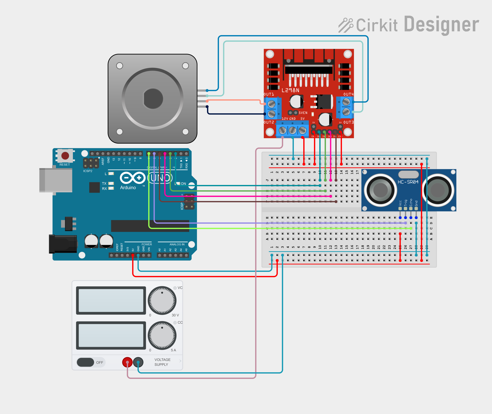
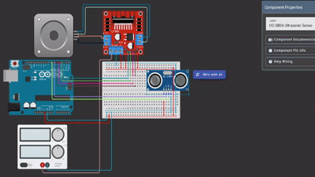

<h1 align="center">Arduino Stepper Motor & Ultrasonic Obstacle Avoidance</h1>

<p align="center">
  
  
  
  
</p>

<p align="center">
  <a href="SLSU.gif">🎥 Live Demo</a> •
  <a href="circuit.png">🖼️ Circuit Diagram</a> •
  <a href="SLSU.ino">💻 Source Code</a> •
  <a href="https://app.cirkitdesigner.com/project/f984b93f-06a3-4c47-8cf9-42f78197773c">🌐 Simulation</a>
</p>

---

## 📖 Overview

This project demonstrates obstacle detection using an **HC-SR04 Ultrasonic Sensor**, a **Bipolar Stepper Motor**, and an **L298N Motor Driver** with an **Arduino Uno**.

The stepper motor rotates continuously under normal conditions. When the ultrasonic sensor detects an object within **10 cm**, the motor briefly stops and automatically reverses its rotation direction.

> **Note:** If your simulator has difficulty detecting objects at 10 cm, you can temporarily increase the detection distance in the code (for example, to **100 cm**) for easier testing.

---

## ✨ Features

- 🔄 Continuous stepper motor rotation
- 📏 Distance measurement using HC-SR04
- 🛑 Stops when an obstacle is detected
- 🔁 Automatically reverses motor direction
- 🔌 Uses an external power supply with a shared ground
- 💻 Compatible with Arduino IDE

---

## 🛠️ Components Used

- Arduino Uno R3
- L298N Motor Driver
- Bipolar Stepper Motor
- HC-SR04 Ultrasonic Sensor
- Breadboard
- External Power Supply (PSU)
- Jumper Wires

---

## 🔌 Pin Configuration

| Component | Arduino Pin |
|-----------|-------------|
| L298N IN1 | D2 |
| L298N IN2 | D3 |
| L298N IN3 | D4 |
| L298N IN4 | D5 |
| HC-SR04 Trig | D6 |
| HC-SR04 Echo | D7 |

---

## ⚙️ How It Works

1. The stepper motor rotates continuously.
2. The HC-SR04 continuously measures the distance in front of the system.
3. If an object is detected within **10 cm**:
   - The motor stops briefly.
   - The motor direction is reversed.
4. The motor continues rotating until another obstacle is detected.

---

## 📂 Project Structure

```text
.
├── README.md
├── task2.ino
├── circuit.png
├── demo.gif
└── LICENSE
```

---

## 🖼️ Circuit Diagram

<p align="center">
  
</p>

---

## 🎥 Demonstration

<p align="center">
  
</p>

---

## 🚀 Getting Started

1. Clone this repository.
2. Open `task2.ino` using the Arduino IDE.
3. Build the circuit as shown in `circuit.png`.
4. Upload the sketch to your Arduino Uno.
5. Power the L298N using an external power supply.
6. Ensure the Arduino and PSU share a common ground.
7. Place an object within **10 cm** of the ultrasonic sensor and observe the motor reverse direction.

---

## 📄 License

This project is licensed under the **MIT License**.

---

<p align="center">
Made with ❤️ using Arduino
</p>
