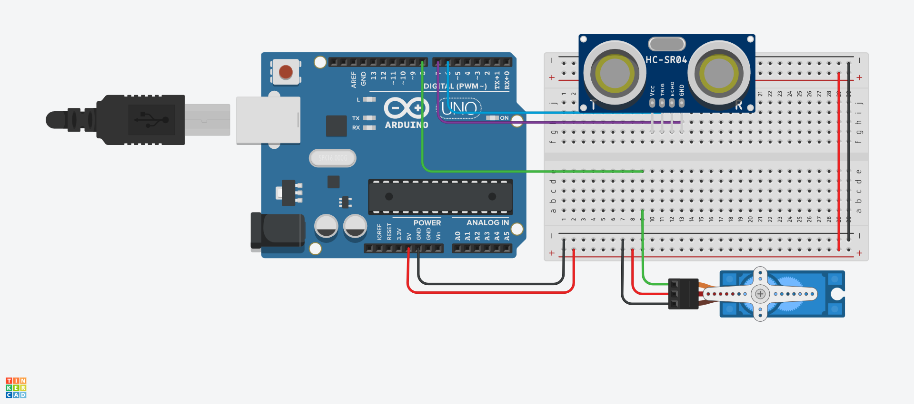

# Arduino Servo & Ultrasonic Obstacle Detection

This project demonstrates obstacle detection using an HC-SR04 ultrasonic sensor and a servo motor with an Arduino Uno in Tinkercad.

## Objective

Create a system that:

- Detects objects using an HC-SR04 ultrasonic sensor.
- Measures the distance to nearby objects.
- Rotates the servo motor when an object is detected within the specified distance.
- Returns the servo to its default position when no object is nearby.

## Components

- Arduino Uno
- HC-SR04 Ultrasonic Sensor
- Servo Motor
- Breadboard
- Jumper Wires

## Pin Configuration

| Component | Arduino Pin |
|----------|-------------|
| Servo Signal | D8 |
| Ultrasonic Trigger | D6 |
| Ultrasonic Echo | D7 |
| 5V | 5V |
| GND | GND |

## Setup Photo

## How It Works

1. The ultrasonic sensor continuously measures the distance to nearby objects.
2. If an object is detected within **20 cm**, the servo rotates to **180°**.
3. If no object is detected within the threshold, the servo returns to **90°**.

## Features

- Real-time distance measurement.
- Automatic obstacle detection.
- Servo angle adjustment based on object distance.
- Designed and tested in Tinkercad.

## Author

**V**
